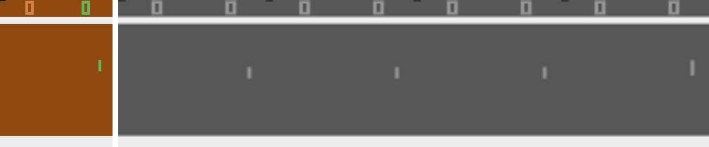
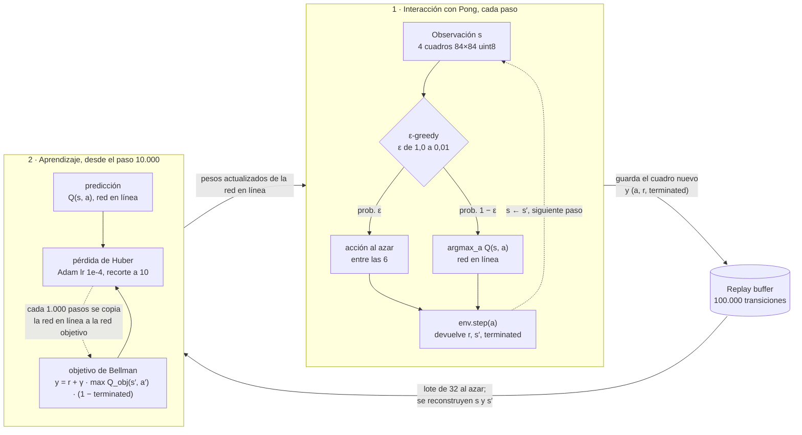
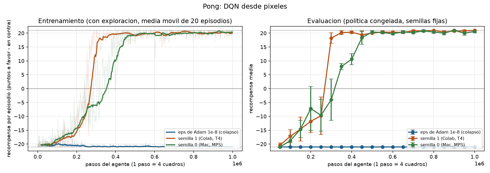
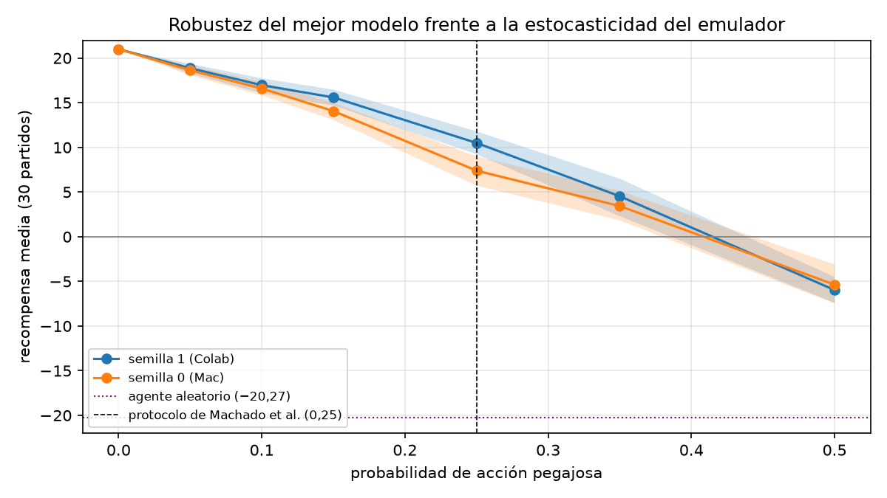

# Pong con Deep Q-Network desde píxeles

[](https://github.com/glizano/pong_dqn/actions/workflows/ci.yml)
[](.python-version)
[](LICENSE)
[](https://colab.research.google.com/github/glizano/pong_dqn/blob/main/notebooks/entrenar_colab.ipynb)
[](CITATION.cff)

**Aprender a jugar viendo solo la pantalla.** Taller 2 de la Unidad 3, curso Simulación y Aprendizaje por Refuerzo, Maestría en Inteligencia Artificial, Universidad de La Sabana (Chía, Colombia), periodo 2026-2.

Autores: Leonar Socarrás Molina (leonarsomo@unisabana.edu.co), John Jairo Serrano Cifuentes (johnseci@unisabana.edu.co), Brezhnev Joya Miranda (brezhnevjomi@unisabana.edu.co), Gabriel Alonso Lizano Alvarado (gabriellial@unisabana.edu.co), Bryan Johann Aranzazu Medina (bryanarme@unisabana.edu.co), ORCID [0000-0003-0601-9151](https://orcid.org/0000-0003-0601-9151). Docente: Emilio Muñoz Pérez.



## Resumen

Entrenamos un agente Deep Q-Network que aprende a jugar Pong (`ALE/Pong-v5`) viendo solo
la pantalla, con el preprocesamiento y la red convolucional de Mnih et al. (2015). Hicimos
dos corridas independientes de 1.000.000 de pasos (semillas 0 y 1). En las dos, el mejor
modelo gana los 30 partidos de la evaluación final **21 a 0**, frente a −20,27 de un
agente aleatorio. Con acciones pegajosas, que rompen el determinismo del emulador, la
ventaja baja a **+10,5** y **+7,4**: las dos corridas descubrieron por separado la misma
jugada repetible, que anota cada 78 pasos y que depende de que el emulador sea
determinista. El hallazgo que más nos costó fue un colapso silencioso: con el `eps` por
defecto de Adam en PyTorch (1e-8), la tercera convolución quedó sin ninguna unidad
activa antes del paso 50.000 y la red devolvía el mismo valor para toda pantalla. Subirlo
a 1,5e-4, el valor de Rainbow, lo resolvió.

## Probarlo en Google Colab, sin instalar nada

[](https://colab.research.google.com/github/glizano/pong_dqn/blob/main/notebooks/entrenar_colab.ipynb)

1. Abrir el notebook con el botón de arriba (hace falta una cuenta de Google).
2. **Entorno de ejecución → Cambiar tipo de entorno de ejecución → GPU T4** (gratuita).
3. Elegir una de las dos opciones:

| para | celdas | tiempo | necesita Drive |
|---|---|---|---|
| **ver jugar al agente ya entrenado** (evaluación en 10 partidos y GIF) | 1 y A | unos 3 minutos | no |
| **entrenar desde cero** y reproducir los resultados | 1 a 5 | unas 2 horas | sí, ahí guarda resultados y pesos |

Si Colab se desconecta durante el entrenamiento, basta con volver a correr las celdas 1
y 2 y la de entrenamiento agregando `--reanudar`: retoma desde el último punto de
control guardado en Drive. El detalle de cada comando está en la sección 9.

---

## 1. Por qué este ambiente

El enunciado pide un ambiente de Gymnasium no trabajado previamente en el curso. Entre
los que cumplen esa condición buscamos uno que exigiera más que los de control clásico
y Box2D, cuyo estado es un vector de pocas variables: los juegos de Atari entregan la
pantalla como observación y obligan a trabajar con una red convolucional.

Elegimos Pong porque tiene tres propiedades útiles para el taller:

- **La observación es una imagen.** Hay que decidir cómo preprocesarla, y la
  decisión de apilar cuadros deja de ser opcional (sección 2.3).
- **El estado no es markoviano cuadro a cuadro.** Es el caso de libro para discutir
  la propiedad de Markov y por qué se apilan cuadros.
- **Es el juego de Atari más estudiado con DQN** (Mnih et al., 2013, 2015), así que hay una referencia clara de
  lo que significa "resuelto": ganar los partidos 21 a algo, con recompensa cercana
  a +21.

---

## 2. Acciones y observaciones

Todo lo que sigue lo obtuvimos del propio entorno con `pong-dqn inspeccionar`, sobre la interfaz de Gymnasium (Towers et al., 2024).

### 2.1 Observación del emulador (antes del preprocesamiento)

`Box(0, 255, (210, 160, 3), uint8)`: la pantalla RGB completa de la consola, 210
filas por 160 columnas, 60 cuadros por segundo.

### 2.2 Observación que recibe el agente (después del preprocesamiento)

`Box(0, 255, (4, 84, 84), uint8)`: los **4 cuadros más recientes**, en escala de
grises y reescalados a 84 × 84.

| eje | tamaño | significado |
|-----|--------|-------------|
| 0 | 4 | cuadros consecutivos, del más viejo al más nuevo |
| 1 | 84 | filas |
| 2 | 84 | columnas |

Se guarda como `uint8` y la red la convierte a `float32` dividiendo entre 255
dentro de su `forward`. Así el replay buffer ocupa la cuarta parte de memoria que
si se guardara en `float32`.

### 2.3 Preprocesamiento y por qué cada paso

| paso | qué hace | por qué |
|------|----------|---------|
| salto de 4 cuadros | repite la acción 4 cuadros y devuelve solo el último | 4 cuadros son 1/15 de segundo; decidir a 60 Hz no aporta y multiplica por 4 el cómputo |
| máximo de los 2 últimos | toma el máximo píxel a píxel de los cuadros 3 y 4 | el emulador no dibuja todos los objetos en todos los cuadros (parpadeo); sin esto la pelota puede desaparecer de la observación |
| escala de grises | 3 canales → 1 | en Pong el color no distingue nada que la intensidad no distinga ya |
| reescalado a 84 × 84 | 210 × 160 → 84 × 84 | reduce 5 veces los píxeles; la pelota sigue siendo visible |
| hasta 30 no-ops al inicio | un número aleatorio de pasos sin hacer nada tras `reset()` | el emulador es determinista; sin esto todos los episodios arrancan idénticos y el agente puede memorizar una secuencia en vez de aprender a jugar |
| **apilar 4 cuadros** | la observación son los 4 últimos cuadros | ver abajo |

**Por qué apilar cuadros.** Un solo cuadro muestra *dónde* está la pelota pero no
*hacia dónde va* ni a qué velocidad. Con una sola imagen, la misma posición de la
pelota puede requerir subir la paleta (viene hacia mí) o quedarse quieto (se aleja),
así que la observación no basta para decidir: el proceso no es markoviano y el
supuesto sobre el que descansa toda la ecuación de Bellman se rompe. Con cuatro
cuadros la red puede inferir dirección y velocidad a partir del desplazamiento
entre ellos.

La comparación con LunarLander lo deja claro: allí el
vector de estado ya trae las velocidades como componentes explícitas, así que un solo
paso de observación es markoviano y apilar no aporta nada. En Pong las velocidades
no están en ningún lado excepto en la diferencia entre cuadros.

### 2.4 Espacio de acción

`Discrete(6)`, `dtype=int64`.

| acción | nombre | efecto en Pong |
|--------|--------|----------------|
| 0 | NOOP | no mover la paleta |
| 1 | FIRE | igual que NOOP (el saque es automático) |
| 2 | RIGHT | mover la paleta hacia arriba |
| 3 | LEFT | mover la paleta hacia abajo |
| 4 | RIGHTFIRE | igual que RIGHT |
| 5 | LEFTFIRE | igual que LEFT |

Hay **tres efectos distintos repartidos en seis acciones**. Lo comprobamos
directamente: con la misma semilla, 200 pasos de FIRE producen exactamente los mismos
cuadros que 200 de NOOP, y lo mismo RIGHTFIRE frente a RIGHT. Dejamos las seis porque
es el conjunto mínimo que expone el entorno por defecto, y porque la redundancia es
en sí una prueba: si el agente aprende bien, los valores Q de las acciones
equivalentes deberían quedar más cerca entre sí que los de acciones distintas. Así
fue (sección 6).

### 2.5 Recompensas

- **+1** cuando el agente anota un punto.
- **−1** cuando lo anota el rival (la IA del juego).
- **0** en cualquier otro paso.

La recompensa por episodio es `puntos a favor − puntos en contra`, en el rango
**[−21, +21]**. Es una recompensa **escasa**: en un episodio aleatorio de unos 950
pasos solo unos 20 pasos pagan algo distinto de cero.

**Línea base aleatoria** (30 episodios, semillas fijas): **−20,27 ± 0,85**, con 948
pasos por episodio en promedio. El agente aleatorio anota como mucho 3 puntos.

Mnih et al. (2015) recortan las recompensas a {−1, 0, +1} para usar los mismos
hiperparámetros en los 49 juegos. En Pong ese recorte no cambia nada porque la
recompensa ya está en ese conjunto; el código lo aplica igual por fidelidad al
protocolo.

### 2.6 Terminación del episodio

- `terminated = True` cuando alguno de los dos llega a **21 puntos**. Es un final
  real: no hay futuro que descontar.
- `truncated = True` a los **108.000 cuadros del emulador** (27.000 pasos del
  agente, unos 30 minutos de juego). Es un corte administrativo y el estado sí tiene
  continuación.

El buffer guarda `terminated`, no `terminated or truncated`, para que la ecuación de
Bellman siga haciendo bootstrap cuando el episodio se corta por tiempo.

### 2.7 Acciones pegajosas

`ALE/Pong-v5` trae por defecto `repeat_action_probability = 0.25`: con probabilidad
1/4 el emulador ignora la acción elegida y repite la anterior (Machado et al., 2018).
Esto se introdujo para que un agente no pueda explotar el determinismo del emulador.
Aquí **entrenamos sin acciones pegajosas** (0,0), como en el DQN original, y
**evaluamos con ambos valores** para medir si la política depende de ese determinismo.

---

## 3. Flujo de entrenamiento

El ciclo tiene dos bucles que se encuentran en el replay buffer: el de **interacción**, que
juega y guarda experiencia, y el de **aprendizaje**, que toma lotes al azar de esa experiencia
y ajusta la red.



El mismo ciclo, paso a paso:


```
inicializar Q (red en línea) y Q_obj (copia), buffer vacío
obs ← env.reset()                                  (4, 84, 84) uint8
repetir hasta 1.000.000 de pasos:
  ┌─ 1. ACCIÓN ε-greedy
  │     ε decae linealmente de 1,0 a 0,01 en los primeros 250.000 pasos
  │     con prob. ε → acción al azar entre las 6; si no → argmax_a Q(obs)[a]
  ├─ 2. PASO: obs2, r, terminated, truncated ← env.step(a)
  ├─ 3. ALMACENAR: se guarda solo el cuadro nuevo de obs2, más (a, sign(r), terminated)
  ├─ 4. APRENDER (desde el paso 10.000, en cada paso):
  │     muestrear 32 transiciones; reconstruir s y s' como pilas de 4 cuadros
  │     y = r + γ · max_a' Q_obj(s')[a'] · (1 − terminated)       ← Bellman
  │     pérdida de Huber entre Q(s)[a] e y; recorte de gradiente a norma 10;
  │     Adam con lr 1e-4 y eps 1,5e-4
  ├─ 5. SINCRONIZAR: cada 1.000 pasos, Q_obj ← Q
  ├─ 6. FIN DE EPISODIO: registrar recompensa, reset(), marcar inicio en el buffer
  └─ 7. EVALUAR cada 50.000 pasos: 10 partidos con ε = 0 y semillas fijas;
        si la media supera la mejor anterior, guardar saves/<etiqueta>/mejor.pt;
        revisar además la salud de la red (unidades vivas de conv3, variación de Q)
```

### 3.1 Los componentes del ciclo DQN

**Replay buffer.** Rompe la correlación entre transiciones consecutivas (en Pong,
cientos de cuadros seguidos casi idénticos) y permite reutilizar cada transición en
muchos lotes. Capacidad de 100.000 transiciones.

**ε-greedy.** Exploración uniforme que decae por **pasos**, no por episodios,
porque la duración de un episodio de Pong cambia mucho a medida que el agente mejora
(unos 800 a 950 pasos perdiendo casi todos los puntos, más de 2.000 en partidos
disputados).

**Red objetivo.** Una copia congelada de la red que produce el `max_a' Q(s', a')`
del objetivo. Sin ella la red perseguiría un blanco que se mueve con cada paso de
gradiente.

**Actualización de Bellman.** `y = r + γ · max_a' Q_obj(s', a') · (1 − terminated)`,
con γ = 0,99.

### 3.2 Particularidades de este ambiente y cómo se atienden

**a) El buffer guarda cuadros, no pilas.** Guardar `s` y `s'` como pilas de 4
cuadros costaría 56 KB por transición: **5,6 GB** para 100.000 transiciones. Pero dos
pilas consecutivas comparten 3 de sus 4 cuadros, así que el buffer guarda solo el
cuadro nuevo de cada paso (7 KB) y reconstruye las pilas al muestrear: **700 MB**.
La reconstrucción tiene dos trampas: no mezclar cuadros de dos partidos distintos
(al inicio de un episodio se repite el primer cuadro, como hace el propio entorno) y
no leer cuadros que el buffer circular ya sobrescribió. `tests/test_buffer.py`
compara, para cientos de transiciones, cada pila reconstruida contra la que entregó
el entorno, forzando que el buffer dé la vuelta y que haya cortes de episodio
frecuentes.

**b) Recompensa escasa y tardía.** Con −1 por punto perdido y nada más, al principio
el único aprendizaje posible es "esto terminó mal", sin saber qué acción de los
últimos cientos de pasos lo causó. γ = 0,99 da un horizonte efectivo de unos 100
pasos, suficiente para conectar el movimiento de la paleta con el punto unos 20 a 40
pasos después.

**c) 10.000 pasos aleatorios antes del primer gradiente.** Para que los primeros
lotes no salgan de un buffer con tres jugadas.

**d) La red objetivo se sincroniza por pasos.** Por la misma razón que ε decae por
pasos: la longitud del episodio no es constante.

**e) Evaluamos aparte y guardamos el mejor por evaluación.** La recompensa de
entrenamiento mezcla la calidad de la política con el nivel de exploración. El
modelo que reportamos es el de mejor evaluación con política congelada, no el último.

**f) Gradientes diminutos y Adam.** En casi todos los lotes la recompensa es 0, así que
los gradientes son muy pequeños. Adam divide cada gradiente por una estimación de su
magnitud más `eps`; con el `eps` por defecto (1e-8) esa división convierte gradientes
casi nulos en pasos de tamaño completo en direcciones de ruido. Usamos 1,5e-4, el valor
de Rainbow (Hessel et al., 2018). La sección 7 cuenta cómo lo descubrimos.

---

## 4. La red neuronal

### 4.1 Arquitectura

La red de Mnih et al. (2015). Las convoluciones extraen posición y movimiento de
paletas y pelota; las capas densas convierten eso en un valor por acción.

| capa | tipo | filtros / neuronas | kernel | stride | salida | parámetros |
|------|------|--------------------|--------|--------|--------|-----------:|
| entrada | uint8 / 255 | | | | 4 × 84 × 84 | 0 |
| conv1 | Conv2d + ReLU | 32 | 8 × 8 | 4 | 32 × 20 × 20 | 8.224 |
| conv2 | Conv2d + ReLU | 64 | 4 × 4 | 2 | 64 × 9 × 9 | 32.832 |
| conv3 | Conv2d + ReLU | 64 | 3 × 3 | 1 | 64 × 7 × 7 | 36.928 |
| aplanar | | | | | 3.136 | 0 |
| fc | Linear + ReLU | 512 | | | 512 | 1.606.144 |
| salida | Linear | 6 | | | 6 | 3.078 |
| | | | | | **total** | **1.687.206** |

Tamaño de salida de cada convolución sin relleno: `(L − k) / s + 1`, que da
84 → 20 → 9 → 7.

**Por qué este diseño.**

- **La primera convolución es grande y con stride 4** porque la imagen tiene mucha
  redundancia espacial: tras el reescalado la pelota ocupa apenas uno o dos píxeles,
  y un kernel de 8 × 8 con paso 4 la captura sin gastar cómputo en el fondo.
- **Los 4 cuadros entran como 4 canales** de la primera convolución. Así cada
  filtro ve los cuatro instantes a la vez y puede aprender detectores de movimiento
  (un borde que se desplaza entre canales).
- **No hay pooling.** El pooling da invariancia a la posición, y en Pong la posición
  exacta de la pelota respecto de la paleta es justo lo que importa. Los strides
  reducen resolución sin descartar dónde está cada cosa.
- **El 95 % de los parámetros está en la capa de 3.136 a 512**, que es donde se
  combina la información espacial de toda la pantalla.
- **La salida no tiene activación**: los valores Q son retornos esperados y pueden
  ser negativos.

### 4.2 Hiperparámetros

| hiperparámetro | valor | razón |
|---|---|---|
| optimizador | Adam, lr = 1e-4 | el valor de la implementación de referencia de Pong en Lapan (2020); la red es 90 veces más grande que la de LunarLander y un paso grande mueve demasiados pesos a la vez |
| `eps` de Adam | 1,5e-4 | con 1e-8 la red colapsó (sección 7); 1,5e-4 es el de Rainbow (Hessel et al., 2018) |
| γ | 0,99 | horizonte de ~100 pasos, suficiente para ligar la jugada con el punto |
| tamaño de lote | 32 | el de Mnih et al. (2015) |
| capacidad del buffer | 100.000 | 700 MB con el buffer por cuadros; entre 40 y 100 partidos de historia según lo que duren |
| pasos antes de aprender | 10.000 | que el primer lote no salga de un buffer casi vacío |
| gradientes por paso | 1 | más eficiente en muestras que 1 cada 4 cuando el presupuesto es de 1 millón de pasos y no de 50 |
| sincronización del objetivo | cada 1.000 pasos | ver sección 3.2d |
| ε | 1,0 → 0,01 lineal en 250.000 pasos | un cuarto del presupuesto explorando |
| pérdida | Huber | acota el gradiente cuando el error es grande, que es el efecto del recorte de error de Mnih et al. |
| recorte de gradiente | norma 10 | segunda barrera contra actualizaciones grandes |
| presupuesto | 1.000.000 de pasos (4 millones de cuadros) | ver sección 5 |

---

## 5. Resultados

### 5.1 Curvas



Izquierda: recompensa por episodio durante el entrenamiento (con exploración), media
móvil de 20 episodios. Derecha: evaluación cada 50.000 pasos, 10 partidos con la
política congelada y semillas fijas. En azul, la primera corrida, con el `eps` de Adam
por defecto (sección 7). En naranja y verde, dos corridas con la corrección, idénticas
salvo por la semilla y el equipo: semilla 1 en una GPU T4 de Colab (2,1 horas) y
semilla 0 en un Mac con MPS (6,0 horas).

### 5.2 Evolución

Evaluación cada 50.000 pasos (10 partidos; entre paréntesis, partidos ganados):

| pasos | semilla 1 (Colab) | semilla 0 (Mac) | lo que pasa |
|---|---|---|---|
| 50.000 | −20,40 (0) | −21,00 (0) | devuelve la pelota de vez en cuando |
| 100.000 | −17,20 (0) | −18,80 (0) | |
| 150.000 | −14,60 (0) | −14,60 (0) | |
| 200.000 | −11,80 (0) | −7,20 (4) | |
| 250.000 | −9,80 (0) | −9,60 (0) | ε llega a su mínimo (0,01) |
| 300.000 | **+18,20 (10)** | −4,00 (4) | |
| 350.000 | +20,20 (10) | +8,00 (10) | |
| 400.000 | +20,30 (10) | +10,60 (10) | |
| 450.000 | +19,40 (10) | **+18,40 (10)** | |
| 500.000 a 750.000 | entre +20,00 y +20,80 (10) | entre +19,80 y +20,80 (10) | |
| 800.000 | **+21,00 (10)**, mejor modelo | +20,40 (10) | |
| 900.000 | +20,80 (10) | **+21,00 (10)**, mejor modelo | |
| 1.000.000 | +21,00 (10) | +20,60 (10) | |

| entrenamiento | semilla 1 (Colab) | semilla 0 (Mac) |
|---|---|---|
| primer partido ganado | episodio 182 (paso 242.663) | episodio 174 (paso 239.217) |
| media móvil de 20 episodios cruza el cero | paso 272.492 | paso 355.582 |
| partidos perdidos después del paso 400.000 | 0 de 343 | 0 de 337 |
| duración media de los partidos, primeros 50 → últimos 50 | 917 → 1.726 pasos | 928 → 1.712 pasos |

Las dos corridas ganan su primer partido casi en el mismo paso (unos 240.000), pero la
semilla 0 tarda unos 150.000 pasos más en consolidar la política.

### 5.3 Evaluación final

Mejor modelo de cada corrida, 30 partidos con semillas fijas y ε = 0:

| corrida | emulador | recompensa media | mín | máx | ganados | pasos por partido |
|---|---|---|---|---|---|---|
| semilla 1 (paso 800.000) | determinista | **+21,00 ± 0,00** | +21 | +21 | **30/30** | 1.658 |
| semilla 0 (paso 900.000) | determinista | **+21,00 ± 0,00** | +21 | +21 | **30/30** | 1.646 |
| semilla 1 | acciones pegajosas (0,25) | **+10,50 ± 3,66** | +4 | +17 | **30/30** | 2.569 |
| semilla 0 | acciones pegajosas (0,25) | **+7,40 ± 4,62** | −3 | +15 | **28/30** | 2.868 |
| agente aleatorio | determinista | −20,27 ± 0,85 | −21 | −18 | 0/30 | 948 |

Los registros completos están en `resultados/dqn_v2/` (semilla 1) y
`resultados/dqn_v2_mac/` (semilla 0): `episodios.csv`, `evaluaciones.csv`,
`final_sticky0.json` y `final_sticky025.json`. Los modelos, en `saves/dqn_v2/mejor.pt` y
`saves/dqn_v2_mac/mejor.pt`.

### 5.4 Salud de la red

| corrida | unidades de conv3 activas | variación de Q entre pantallas | resultado |
|---|---|---|---|
| `eps` = 1e-8 | 0 de 3.136 (0 %) desde antes del paso 50.000 | 0 (salida constante) | −21 en las 20 evaluaciones |
| `eps` = 1,5e-4, semilla 1 | entre 88 % y 97 % en toda la corrida | entre 0,30 y 0,48 | +21 |
| `eps` = 1,5e-4, semilla 0 | entre 88 % y 96 % en toda la corrida | entre 0,34 y 0,44 | +21 |

### 5.5 Robustez frente a la estocasticidad del emulador

Para medir cuánto del +21 depende del determinismo, evaluamos los dos mejores modelos con
siete niveles de acciones pegajosas, 30 partidos por nivel y las mismas semillas de la
evaluación final. Los valores de 0 y 0,25 coinciden con los de la sección 5.3.



| acción pegajosa | semilla 1 (Colab) | ganados | semilla 0 (Mac) | ganados |
|---|---|---|---|---|
| 0,00 | +21,00 [21,00; 21,00] | 30/30 | +21,00 [21,00; 21,00] | 30/30 |
| 0,05 | +18,87 [18,27; 19,37] | 30/30 | +18,63 [18,07; 19,17] | 30/30 |
| 0,10 | +16,97 [16,07; 17,73] | 30/30 | +16,60 [15,83; 17,33] | 30/30 |
| 0,15 | +15,60 [14,70; 16,47] | 30/30 | +14,07 [13,07; 15,00] | 30/30 |
| 0,25 | +10,50 [9,23; 11,80] | 30/30 | +7,40 [5,73; 9,00] | 28/30 |
| 0,35 | +4,53 [2,30; 6,50] | 24/30 | +3,43 [1,83; 5,13] | 23/30 |
| 0,50 | −5,97 [−7,40; −4,50] | 3/30 | −5,37 [−7,47; −3,10] | 5/30 |

Entre corchetes, intervalo bootstrap del 95 % de la media (10.000 remuestreos). La
degradación es progresiva y se acelera: cada 0,05 de probabilidad de repetir la acción
anterior cuesta entre 1,5 y 2 puntos por partido por debajo de 0,15, y entre 2,5 y 3,5
por encima. Ninguno de los dos modelos pierde un partido hasta 0,15, y
el saldo cruza el cero alrededor de 0,4. Con la mitad de las acciones ignoradas los dos
pierden casi todos los partidos, aunque siguen muy por encima del agente aleatorio
(−20,27), lo que indica que conservan una política de defensa útil.

Las dos semillas son indistinguibles en los extremos y se separan en la zona intermedia:
la probabilidad de que un partido de la semilla 1 supere a uno de la semilla 0 es 0,67 con
0,15 (U de Mann-Whitney, p = 0,020) y 0,69 con 0,25 (p = 0,011). Esos valores no
sobreviven a la corrección de Holm por las seis comparaciones (p ajustado de 0,065 para
0,25), así que la diferencia entre semillas debe leerse como un indicio que falta confirmar
con más semillas.
`uv run python scripts/robustez.py dqn_v2 dqn_v2_mac` regenera la tabla
(`resultados/robustez_sticky/resumen.csv`) y la figura.

---

## 6. Reflexión sobre los resultados

**El salto entre los pasos 250.000 y 300.000 coincide con el fin de la exploración.**
La evaluación pasa de −9,8 a +18,2 en 50.000 pasos, justo después de que ε llega a su
mínimo (en el paso 200.000 una de cada cinco acciones todavía era al azar). La evaluación
usa siempre ε = 0, así que lo que mejoró fue la red y no solo la forma de medirla.
Nuestra lectura es que mientras el agente explora mucho, el buffer tiene pocos puntos
ganados, porque una acción al azar en mitad de un intercambio suele costar el punto. Al
bajar ε, el agente empieza a encadenar intercambios completos, el buffer se llena de
puntos a favor y el objetivo de Bellman propaga ese valor hacia atrás. La curva de
entrenamiento lo muestra: el primer partido ganado llega en el paso 242.663 y desde ahí
la mejora es muy rápida.

**Un 21 a 0 perfecto es una señal de alerta, no solo un logro.** Con el emulador
determinista el agente gana cada partido 21 a 0, y anota exactamente cada 78 pasos (lo
medimos en un partido completo: 77 o 78 pasos entre un punto y el siguiente, los 21
puntos). Encontró una jugada que, devuelta desde el mismo lugar, el rival no alcanza
nunca. Lo llamativo es que **la otra corrida, con otra semilla y en otro equipo,
encontró exactamente el mismo ritmo de 78 pasos**: no es un accidente de una red, es una
debilidad del rival que el método encuentra de forma sistemática. Eso es legítimo dentro
de las reglas, pero depende de que el emulador repita exactamente lo mismo. Con acciones
pegajosas las mismas redes bajan a +10,5 y +7,4, y sus partidos pasan de unos 1.650
pasos a 2.569 y 2.868: ya no pueden encadenar la jugada y tienen que defender de verdad.
La semilla 0 incluso pierde 2 de los 30 partidos. Aprendieron a jugar, pero buena parte
del margen venía de explotar el determinismo. Es exactamente la crítica de Machado et al.
(2018) a la evaluación de agentes en Atari sin estocasticidad. La curva de la sección 5.5 muestra que esa dependencia es gradual: el margen se
erosiona a medida que crece la estocasticidad, sin un punto de quiebre. Entrenar con
`--sticky 0.25` permitiría comprobar si el agente aprende entonces a defender en lugar de
explotar la jugada repetible.

**Dos corridas, el mismo destino por caminos distintos.** Las dos semillas ganan su
primer partido de entrenamiento casi en el mismo paso (239.217 y 242.663), y las dos
terminan en +21. Pero la semilla 1 pasó de −9,8 a +18,2 entre los pasos 250.000 y
300.000, mientras que la semilla 0 necesitó hasta el paso 450.000 para llegar a +18,4.
Con una sola corrida habríamos reportado "Pong se resuelve en 300.000 pasos" o "en
450.000" según la semilla que nos hubiera tocado; con dos, lo honesto es decir que se
resuelve entre 300.000 y 450.000 pasos con esta configuración.

**Las acciones redundantes quedaron con valores parecidos.** En un partido completo, la
diferencia media de Q entre acciones con el mismo efecto (NOOP y FIRE, RIGHT y
RIGHTFIRE, LEFT y LEFTFIRE) fue de 0,013 a 0,016, frente a 0,046 a 0,059 entre acciones
con efectos distintos. La red descubrió sola que FIRE no hace nada en Pong. Como las
diferencias son pequeñas, el agente alterna entre acciones equivalentes y usa las seis.

**Las redes sobreestiman sus propios valores en un 17 % a 20 %.** En cinco partidos de
evaluación, el Q medio de las acciones elegidas fue 1,48 (semilla 1) y 1,42 (semilla 0),
mientras que el retorno descontado que el agente obtuvo realmente desde esos mismos
estados fue 1,23 y 1,22. Es el sesgo optimista del
`max` en el objetivo de Bellman que describen van Hasselt et al. (2016) y que Double DQN
corrige. Aquí no impidió resolver el juego, porque lo que importa para actuar es el
orden entre acciones y no su valor absoluto, pero sí muestra que los valores Q de DQN no
se pueden leer como predicciones calibradas.

**La limitación estructural es que el agente no ve la puntuación como estado.** El
marcador está en la pantalla, pero la recompensa por punto es la misma con 0 a 0 que con
20 a 0 y γ = 0,99 descuenta todo lo que pase a más de unos cientos de pasos. El agente
optimiza el próximo punto, no el partido. En Pong eso basta porque ganar cada punto es
ganar el partido; en un juego donde convenga sacrificar un punto para ganar el
siguiente, este diseño de recompensa no lo capturaría.

---

## 7. Reflexión sobre lo que más costó

**Un colapso que no lanzaba ningún error.** La primera corrida completa (1.000.000 de
pasos, unas cinco horas en un Mac) y una segunda en Colab dieron −21,00 en las 20
evaluaciones. El código corría, la pérdida no explotaba y no había ninguna excepción.
Al abrir el modelo vimos que la red devolvía exactamente el mismo valor Q para
cualquier pantalla: ninguna de las 3.136 unidades de la tercera convolución se activaba
con ninguna entrada, y ya estaba así en el paso 50.000. La causa era el `eps` de Adam.
Con recompensa 0 en casi todos los lotes, los gradientes son diminutos; Adam los divide
por su propia magnitud más `eps`, y con 1e-8 eso los convierte en pasos de tamaño
completo en direcciones de ruido que fueron apagando las unidades. Lo reprodujimos sin
el juego, entrenando solo sobre un buffer fijo: con 1e-8 las unidades activas de conv3
cayeron de unas 1.590 a 61 en 1.750 actualizaciones; con 1,5e-4 se mantuvieron entre
1.400 y 1.760 durante 8.000. Lo que más costó no fue la corrección, que es un número,
sino aceptar que una curva plana en −21 no decía nada de por qué y que había que mirar
dentro de la red. Desde entonces cada evaluación imprime cuántas unidades siguen vivas
y avisa si la red colapsa; los registros de aquella corrida están en
`resultados/colapso_adam_eps_1e-8/`.

**Cambiar de ambiente a mitad del taller.** El trabajo empezó en LunarLander, pero ese
ambiente ya se había trabajado en el curso y no cumplía el requisito del enunciado. Lo
aprendido allí (sección 8) lo trasladamos, pero la red, el preprocesamiento y el buffer
tuvimos que hacerlos de nuevo.

**Diseñar el buffer por cuadros sin equivocarse.** Es la parte del código con más
formas de fallar en silencio. Un error de índices no lanza excepciones: produce
pilas que mezclan el último cuadro de un partido con el primero del siguiente, o que
leen un cuadro recién sobrescrito, y el agente simplemente aprende peor. La única
defensa fue una prueba que reconstruye cientos de pilas y las compara, píxel a píxel,
con las que entregó el entorno.

**El cómputo, y no por la razón esperada.** Sin GPU propia, un millón de pasos toma
unas seis horas en un Mac y dos en una T4 de Colab. El costo real no fue esperar, fue
que el colapso solo se notó al final de esas horas. Por eso agregamos el diagnóstico de
salud a cada evaluación: hoy el mismo error se vería en el paso 50.000.

---

## 8. Antes de Pong: lo que se aprendió en LunarLander

En el Taller 1 ([leonarsomo/mountain_car](https://github.com/leonarsomo/mountain_car))
vimos que entrenar de más degradaba la tabla de Q-Learning en vez de afinarla, y por eso
separamos allí la evaluación final del entrenamiento. Antes de cambiar de ambiente en este
taller entrenamos DQN y Double DQN en LunarLander-v3, y tres resultados de ese trabajo
definieron cómo evaluamos aquí:

1. **La recompensa de entrenamiento no sirve como criterio de parada.** El mejor
   modelo estuvo en el episodio 600 y no en el 800; con la curva de entrenamiento
   como guía se habría entregado el peor.
2. **Diez episodios de evaluación no bastan.** Con 10 episodios DQN parecía 38 puntos
   mejor que Double DQN; con 20 la diferencia desapareció.
3. **Dos corridas idénticas pueden separarse mucho.** Tres corridas de la misma
   configuración dieron 57, 229 y 149 a los 400 episodios.

Por eso aquí la evaluación es independiente del entrenamiento, con semillas fijas y
política congelada, y la evaluación final usa 30 partidos.

---

## 9. Cómo reproducir

```bash
uv sync
uv run pong-dqn inspeccionar     # espacios, dtype, recompensas y resumen de la red
uv run pong-dqn benchmark        # estima cuánto tardará el entrenamiento en esta máquina
uv run pytest -q                 # 10 pruebas, incluidas la del buffer y la del entorno

# Entrenamiento (en macOS, caffeinate evita que el equipo se duerma)
caffeinate -i uv run pong-dqn entrenar --pasos 1000000 --etiqueta dqn_v2 --semilla 1
# Si se interrumpe, se retoma con:
caffeinate -i uv run pong-dqn entrenar --pasos 1000000 --etiqueta dqn_v2 --semilla 1 --reanudar

# Evaluación final y gráficas
uv run pong-dqn evaluar --modelo saves/dqn_v2/mejor.pt --n 30
uv run pong-dqn evaluar --modelo saves/dqn_v2/mejor.pt --n 30 --sticky 0.25
uv run python scripts/graficar.py colapso_adam_eps_1e-8 dqn_v2 dqn_v2_mac
uv run python scripts/grabar_gif.py --modelo saves/dqn_v2/mejor.pt

# Curva de robustez (sección 5.5): evaluar con varios niveles de acciones pegajosas
for s in 0.05 0.10 0.15 0.35 0.50; do
  uv run pong-dqn evaluar --modelo saves/dqn_v2/mejor.pt --n 30 --sticky $s \
    --salida resultados/robustez_sticky/dqn_v2_sticky$s.json
done
uv run python scripts/robustez.py dqn_v2 dqn_v2_mac

# Entrenar con acciones pegajosas (protocolo de Machado et al., 2018)
caffeinate -i uv run pong-dqn entrenar --pasos 1000000 --etiqueta dqn_sticky --semilla 1 --sticky 0.25
```

En Google Colab con GPU: [`notebooks/entrenar_colab.ipynb`](https://colab.research.google.com/github/glizano/pong_dqn/blob/main/notebooks/entrenar_colab.ipynb) (ver "Probarlo en
Google Colab" al inicio).

## 10. Estructura

```
src/pong_dqn/entorno.py   Pong con el preprocesamiento de Mnih et al. (2015)
src/pong_dqn/buffer.py    replay buffer que guarda cada cuadro una sola vez
src/pong_dqn/red.py       red convolucional de Nature DQN
src/pong_dqn/agente.py    ε-greedy, objetivo de Bellman (DQN y Double DQN), persistencia
src/pong_dqn/entrenar.py  bucle de entrenamiento, evaluación periódica, mejor modelo
src/pong_dqn/evaluar.py   evaluación con política congelada y semillas fijas
src/pong_dqn/cli.py       pong-dqn inspeccionar | entrenar | evaluar | benchmark
scripts/graficar.py       curva de entrenamiento y evaluaciones
scripts/grabar_gif.py     GIF de una partida junto a lo que ve la red
scripts/robustez.py       curva de robustez frente a acciones pegajosas
tests/                    buffer, red, agente y entorno
notebooks/                entrenamiento en Google Colab
resultados/               registros, evaluaciones finales, curvas y GIF
saves/                    mejor modelo de cada corrida
```

## 11. Declaración de uso de IA

Como equipo, utilizamos asistentes de IA como apoyo para la estructuración y programación de la solución, la ejecución y automatización de pruebas, la elaboración de scripts de medición y gráficos, la organización del repositorio y la redacción de la documentación técnica. Revisamos el código, verificamos las métricas contra los registros en `resultados/` y asumimos la responsabilidad colectiva sobre el contenido y las conclusiones presentadas. El diagrama de la sección 3 se generó en Mermaid con ayuda de estas herramientas y lo revisamos contra el código de `src/pong_dqn/`.

## 12. Licencia

Apache 2.0 (ver `LICENSE`)

## Referencias

- Hessel, M., Modayil, J., van Hasselt, H., Schaul, T., Ostrovski, G., Dabney, W.,
  Horgan, D., Piot, B., Azar, M., y Silver, D. (2018). Rainbow: Combining improvements in
  deep reinforcement learning. *Proceedings of the AAAI Conference on Artificial
  Intelligence, 32*(1), 3215-3222. https://doi.org/10.1609/aaai.v32i1.11796
- Lapan, M. (2020). *Deep reinforcement learning hands-on* (2.ª ed.). Packt.
- Machado, M. C., Bellemare, M. G., Talvitie, E., Veness, J., Hausknecht, M., y
  Bowling, M. (2018). Revisiting the Arcade Learning Environment: Evaluation
  protocols and open problems for general agents. *Journal of Artificial Intelligence
  Research, 61*, 523-562. https://doi.org/10.1613/jair.5699
- Mnih, V., Kavukcuoglu, K., Silver, D., Graves, A., Antonoglou, I., Wierstra, D., y
  Riedmiller, M. (2013). *Playing Atari with deep reinforcement learning* [Preprint].
  arXiv. https://doi.org/10.48550/arXiv.1312.5602
- Mnih, V., Kavukcuoglu, K., Silver, D., Rusu, A. A., Veness, J., Bellemare, M. G.,
  Graves, A., Riedmiller, M., Fidjeland, A. K., Ostrovski, G., Petersen, S., Beattie,
  C., Sadik, A., Antonoglou, I., King, H., Kumaran, D., Wierstra, D., Legg, S., y
  Hassabis, D. (2015). Human-level control through deep reinforcement learning.
  *Nature, 518*(7540), 529-533. https://doi.org/10.1038/nature14236
- Towers, M., Kwiatkowski, A., Terry, J., Balis, J. U., De Cola, G., Deleu, T.,
  Goulão, M., Kallinteris, A., Krimmel, M., KG, A., Perez-Vicente, R., Pierré, A.,
  Schulhoff, S., Tai, J. J., Tan, H., y Younis, O. G. (2024). *Gymnasium: A standard
  interface for reinforcement learning environments* [Preprint]. arXiv.
  https://doi.org/10.48550/arXiv.2407.17032
- van Hasselt, H., Guez, A., y Silver, D. (2016). Deep reinforcement learning with double
  Q-learning. *Proceedings of the AAAI Conference on Artificial Intelligence, 30*(1),
  2094-2100. https://doi.org/10.1609/aaai.v30i1.10295
